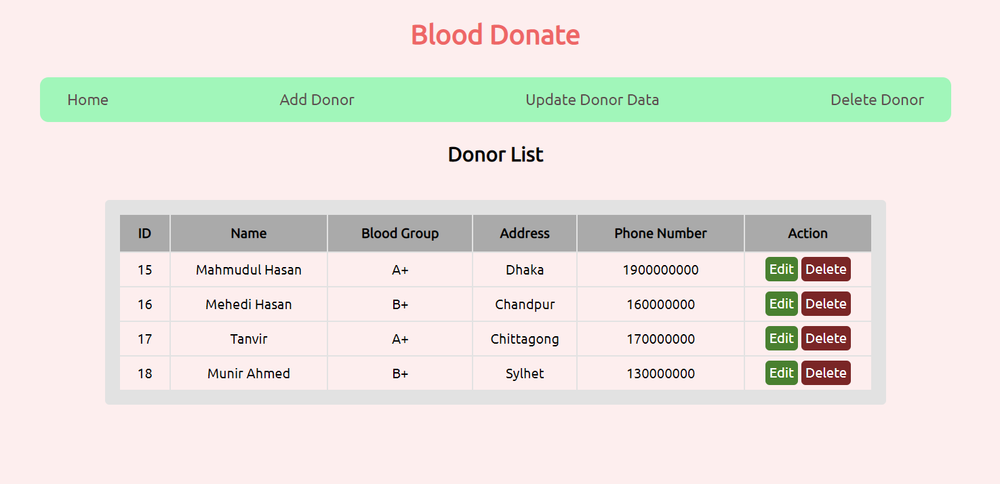

# PHP MYSQL Blood Bank

## In this project we use 
* HTML
* CSS
* PHP
* MYSQL

### How to use this project?
* Install Laragon
* put this project into laragon root folder
* Create DB in MYSQL
* Insert DB into MYSQL DB console
* stop and start all laragon server for fetching new project
* run the project

### Developing Lifecycle
* config
* index.php
* index.php ⟶ edit-donor.php ⟶ update.php
* index.php ⟶ delete-donor.php ⟶ delete.php
* edit-donor.php ⟶ update.php
* add-donor.php ⟶ save.php
* update-donor.php
* delete-donor.php

### For database contact with the Author 
📞 <code>01682568271</code>

Developed by Mahmudul Hasan | NU CSE ALL Batch

